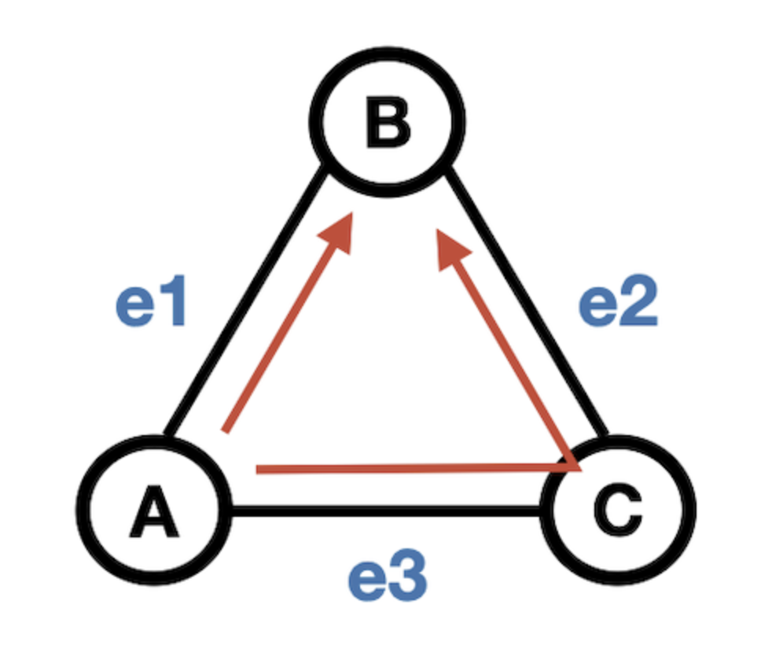
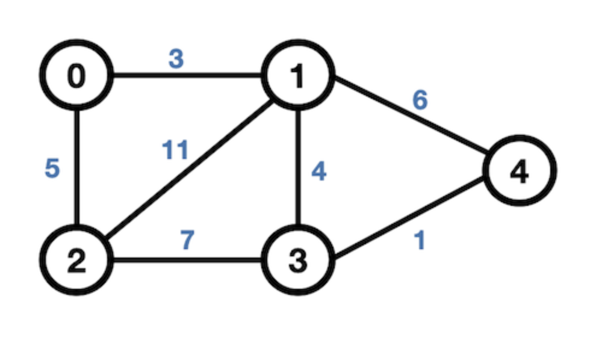

## 그래프
그래프는 단순히 노드(node)와 그 노드를 연결하는 간선(edge)을 하나로 모아 놓은 자료 구조이다.
    - 그래프는 연결되어있는 객체간의 관계를 표현할 수 있는 자료구조이다.
    - 예를들어, 지도, 지하철 노선도의 최단 경로 등이 있다.

#### 그래프와 트리의 차이

| |**그래프**|**트리**|
|------|--------|--------|
|**정의**|노드(node)와 그 노드를 연결하는 간선(edge)을 하나로 모아놓은 자료구조|그래프의 한 종류로 DAG(Directed Acyclic Graph, 즉, 방향성이 있는 순환 그래프)의 한 종류|
|**방향성**|방향 그래프(Directed)   무방향 그래프(Undirected) 모두존재 |방향 그래프(Directed)|
|**사이클**|사이클(Cycle) 가능   자체 간선(self-loop) 가능   순환 그래프(Cyclic), 비순환 그래프(Acyclic) 모두 존재 |사이클(Cycle) 불가능   자체 간선(self-loop) 불가능   비순환 그래프(Acyclic)|
|**루트노드**|루트노드의 개념이 없음|한개의 루트 노드만이 존재   모든 자식 노드는 한개의 부모 노드만을 가짐|
|**부모-자식**|부모-자식의 개념이 없음|부모-자식 관계   모든 자식노드는 한개의 부모 노드만을 가짐|
|**모델**|네트워크 모델|계층 모델(Layer)|
|**순회**|DFS, BFS|DFS, BFS 안의 Pre-, In, Post-order|
|**간선의 수**|그래프에 따라 간선의 수가 다름   간선이 없을 수도 있음|노드가 N인 트리는 항상 N-1의 간선을 가짐|
|**경로**|-|임의의 두 노드 간의 경로는 유일|
|**예시**|지도, 지하철 노선도의 최단경로|이진트리, 이진 탐색트리, 균형트리(AVL트리, red-black 트리), 이진 힙(최대힙, 최소힙)|

### 그래프 용어

  

- 노드(Node)/정점(Vertax): 위의 그림을 보면 동그라미 하나 하나가 있는데 그것을 특정위치인 노드(Node)/정점(Vertex)라고 한다.
- 간선(Edge): 노드와 노드 사이를 연결한 선을 간선이라고한다.
  

  

  

  

- 인접(adjacent): 인접하다의 의미는 위 이미지를 보면 0과 1 노드가 간선으로 연결되어있는데, 이를 인접하다고 설명한다.

 

- 차수(Degree): `무방향 그래프`에서 하나의 정점에 인접한 정점의 수인데,  
위의 그림에서 예를들면, 0번 노드에 인접한 노드는 1번 2번이 있으니까 차수가 2가 된다.
    - 무방향 그래프의 차수의 합: 그래프 간선 수 * 2
- 진입 차수(in-degree): `방향 그래프`에서 외부에서 오는 간선의 수(내차수)이다.  
위의 그림에서 보면 0번 노드 방향으로 오는 간선이 없기 때문에 진입차수가 0이지만 1번 노드의 경우 1번 노드로 오는 간선이 0번, 2번 노드에서 오는 간선이 있기 때문에 진입차수가 2가된다.
- 진출 차수(out-degree): `방향 그래프`에서 외부로 향하는 간선의 수(외차수)이다.  
위의 그림에서 보면 0번 노드에서 1번, 2번 노드 방향으로 간선이 있기 때문에 진출차수는 2가 된다. 

  

   

- Self-loop: 출발지와 목적지가 동일한 정점을 Self-loop라고 하는데, 위의 그림을 보면 4번 정점은 자기 자신한테만 이동이 가능하다.

  

   

- 경로: 정점과 간선이 교대로 구성된 시퀀스이다.  
위의 그림에서보면 A에서 B로 갈때 즉, Path(A, B) 로가는 [A, e1, B] 순서로 가거나 OR [A, e3, C, e2, B] 순으로 가는 경로 두가지가 있다.
- 단순 경로(Simple Path): 정점과 간선이 중복되지 않는 경로를 단순 경로라고한다.
- 경로 길이(Path length): 경로를 구성하는데 사용된 간선의 수를 의미한다.

  

   

- 회로(Cycle): 시작 정점과 끝 정점이 같은 경로이다.  
위의 그림에서보면 B에서 B로갈때 즉, Cycle(B, B)는 [B, e1, A, e3, C, e2, B] 순으로 순환하는 구조이다.

### 그래프 종류

   

- 무방향 그래프(Undirected Graph): 무방향 간선으로 이루어진 그래프이다.  
    - 간선은 간선을 통해 양방향으로 갈 수 있다.
    - 정점 0, 1을 연결하는 간선은 (0,1) or (1,0)으로 동일하다
- 방향 그래프(Directed Graph): 방향이 있는 간선으로 이루어진 그래프이다.
    - 0 -> 1로 가는 간선은 (0,1)로 표현한다.**(1, 0)과는 다른 것이다.**

  

   

- 가중치 그래프(Weighted Graph): 가중치 또는 비용을 갖는 그래프이다.  
    - Network 라고도 한다.
    - 도시 - 도시의 연결, 도로의 길이, 톨게이트 비용 등을 예로 들 수 있다.

  

   

- 완전 그래프(Complete Graph): 임의의 두 정점에 A, B에 대해서 A, B를 잇는 간선 e(A, B)이 존재하는 그래프
    - 완전 그래프는 정규 그래프(모든 정점이 동일한 차수)이다.
    - N개의 정점을 가지는 무방향 그래프의 경우 -> 간선의 개수는 1/2 * N(N - 1) <- 위 이미지의 경우 정점이 4개 이기 떄문에 4 * 3 / 2 = 6개가 간선의 개수이다.
    - N개의 정점을 가지는 방향 그래프 -> 간선의 개수 = N(N - 1) <- 위 이미지의 경우 정점이 4개이고 양방향이기 때문에 4 * 3 = 12가 간선의 개수이다.

- 

